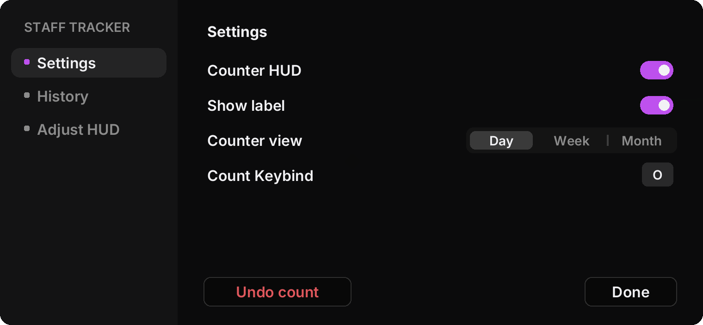
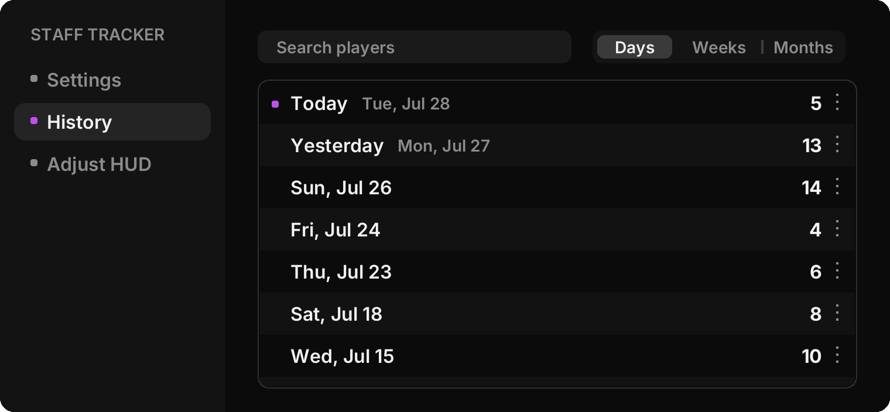
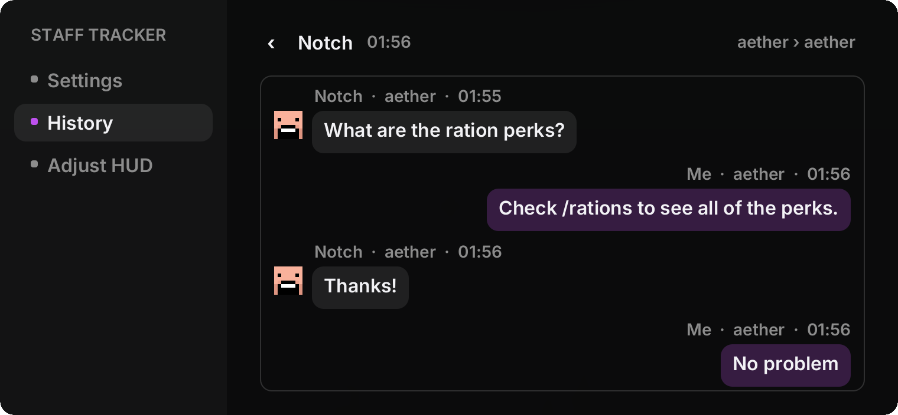

<h1>Staff Tracker <a href="https://github.com/Cosmic-Fun/staff-tracker/releases/latest/download/stafftracker.jar"></a></h1>

A client side helper counter for staff. Press one key when you help a player and the mod keeps score. It also remembers who you helped and what the conversation was.

## Mod Overview

- One keybind counts a helped player. The HUD flashes so you know it registered.
- When you trigger a count, the mod looks at your recent private messages, figures out who you were helping, and saves the conversation from the last thirty minutes along with the planet each of you was on.
- History is browsable by day, week, or month. Click into a day to see every player you helped that day.
- A search box finds every logged interaction with a player by name.
- Anything can be deleted: one interaction, a day, a week, or a whole month. Every delete first shows you exactly what is about to go. Undo takes one count off today and shows the conversation it removes.

## Preview

<p align="center">
  
  
</p>

<p align="center">
  
</p>

## Install

1. Install Fabric Loader 0.19.3 or newer for Minecraft 1.21.11.
2. Put Fabric API in your mods folder.
3. Hit the download button up top and drop `stafftracker.jar` in next to it.

## Using it

- The default keybind is `H`. Change it in settings. Mouse buttons and combos like `Ctrl Shift H` work too.
- Open the pause menu and click **Staff Tracker** in the top right for settings and history.
- Counts roll over at midnight in your own time zone. Weeks run Sunday to Saturday.
- **Adjust HUD** lets you drag the counter anywhere and scroll to resize it in one percent steps.

## Your data

Everything is stored on your machine in `config/stafftracker/`:

- `settings.json` holds the settings.
- `data.json` holds the daily totals.
- `logs/` holds one JSON file per day with the helped players and conversations.

One outside call: the player head icons in the history come from [mc-heads.net](https://mc-heads.net), fetched by username while you browse and only kept in memory. If a head cannot load you get a colored letter tile instead.

## Building from source

```
./gradlew build
```

Java 21 is required and the Gradle toolchain resolves it automatically. The jar lands in `build/libs/`.

Quick map of the code:

- `StaffTrackerClient` wires everything up on client init.
- `StaffTrackerConfig`, `HelpData`, and `InteractionLog` handle settings, counts, and conversation logs, all saved as JSON.
- `MessageWatcher` reads private messages from chat and keeps the last thirty minutes.
- `hud/CounterHud` draws the on screen panel.
- `ui/` holds the widgets and screens. `Theme` has the shared colors and shapes, `TextPainter` is the text renderer.
- `mixin/GameMenuScreenMixin` adds the pause menu button.

The UI draws with its own renderer using the bundled Inter font (SIL OFL 1.1, license included in the jar), so text and shapes stay sharp at any GUI scale on any display.

---

By Cosmic Player. All Rights Reserved, see [LICENSE](LICENSE).
